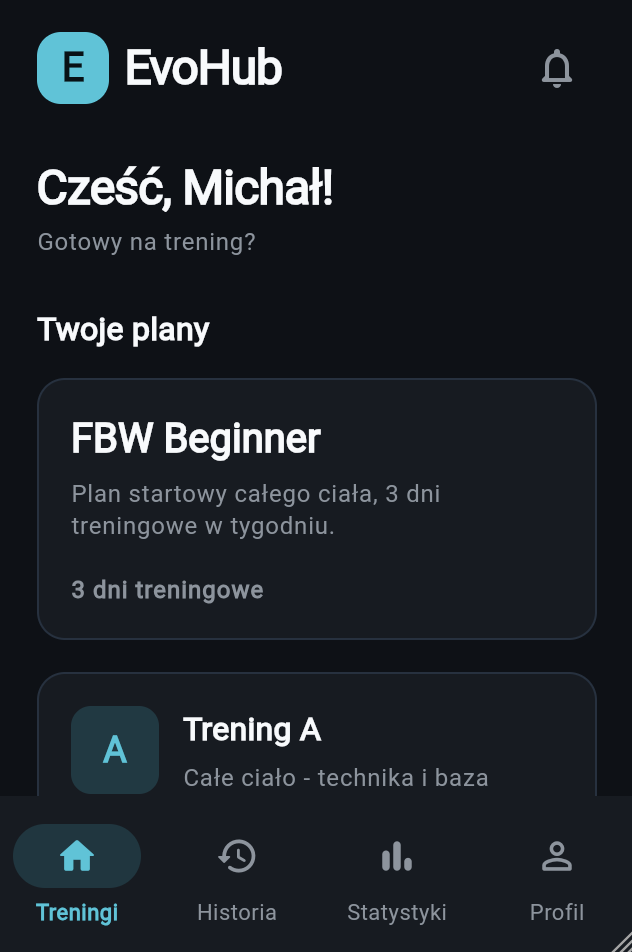
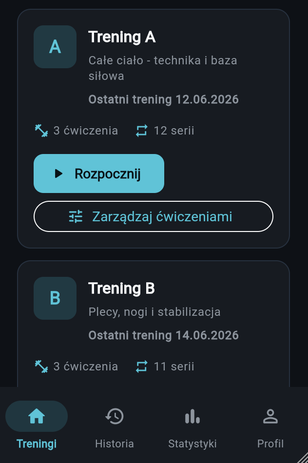
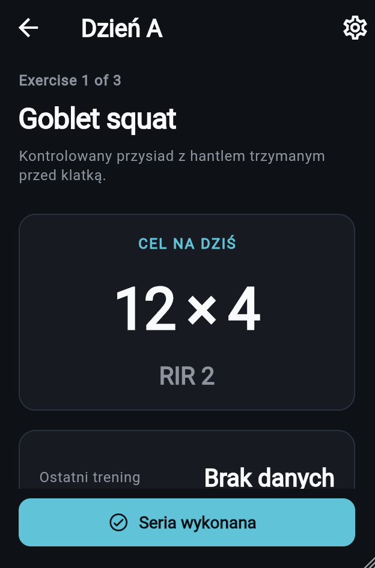
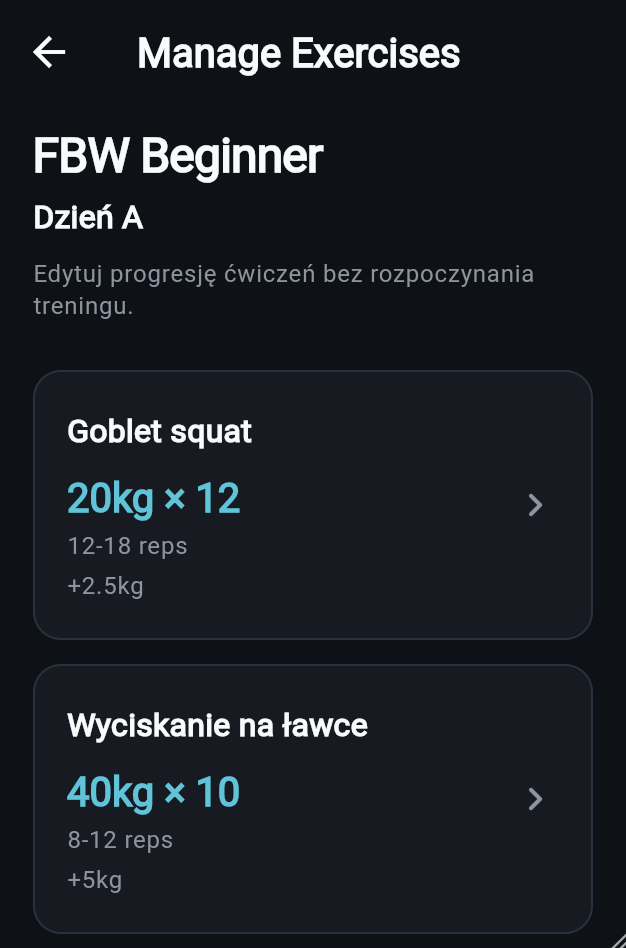
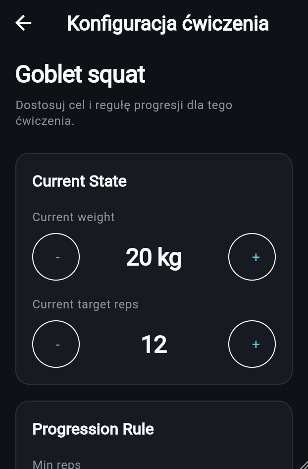

# EvoHub - Progressive Workout Tracker

EvoHub is a Flutter-based workout tracking application focused on simple, sustainable strength progression.

The project was built as a portfolio application to demonstrate Flutter architecture, workout session management, local persistence, and fitness-oriented UX design.

## Features

### Workout Management
- Structured workout plans
- Multi-day training programs
- Exercise execution workflow
- Workout summaries

### Progressive Overload System
- Double progression model
- Configurable rep ranges
- Configurable weight increments
- Per-exercise progression settings
- Automatic next-step suggestions

### Exercise Configuration
- Edit progression settings without starting a workout
- Adjust working weight
- Adjust target repetitions
- Configure rep ranges
- Configure progression increments
- Reset to plan defaults

### Persistence
- Local storage using SharedPreferences
- Workout progression survives app restarts
- Latest exercise performance tracking
- Exercise-specific progression state

### User Experience
- Material 3 dark theme
- Mobile-first design
- Simple workout flow
- Quick progression management

---

## Architecture

The application is organized around the following workout structure:

```text
WorkoutPlan
 └── WorkoutDay
      └── Exercise
           └── ProgressionRule
```

Current progression implementation:

```text
Double Progression

12 reps
 ↓
13 reps
 ↓
14 reps
 ↓
...
 ↓
18 reps
 ↓
Increase weight
 ↓
Back to minimum reps
```

---

## Technology Stack

- Flutter
- Dart
- SharedPreferences
- Material 3

---

## Current MVP Features

- Dashboard
- Workout plans
- Workout execution
- Set tracking
- Double progression
- Exercise progression configuration
- Local persistence
- Workout summary screen
- Exercise management outside workouts

---

## Screenshots

### Dashboard



Main application screen presenting available workout plans and quick access to training management.

---

### Workout Day



Workout overview with exercise list, estimated duration, volume, and workout start action.

---

### Exercise Screen



Focused workout execution screen showing today's target, exercise information, and active workout controls.

---

### Progression Tracking


Built-in double progression system displaying previous performance, current target, and next progression step.

---

### Manage Exercises



Manage exercise progression settings without starting a workout session.

---

### Exercise Configuration



Configure exercise-specific progression parameters including target reps, rep range, progression step, and weight increments.

---

## Roadmap

Planned future improvements:

- Workout history
- Training statistics
- Rest timer enhancements
- Exercise library
- Custom workout plans
- Exercise reordering
- Import/export plans
- Cloud synchronization
- Authentication
- Trainer mode

---

## Status

Project currently in active development.

The MVP workout flow, progression system, local persistence, and exercise management features are implemented and functional.
